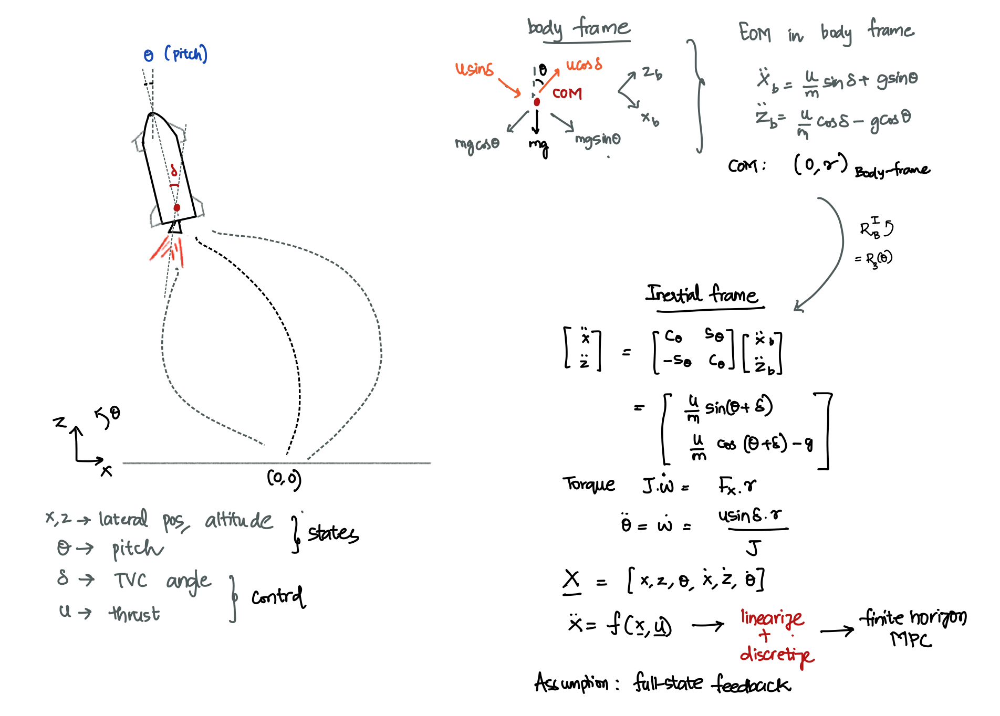
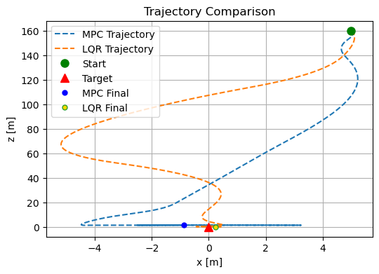
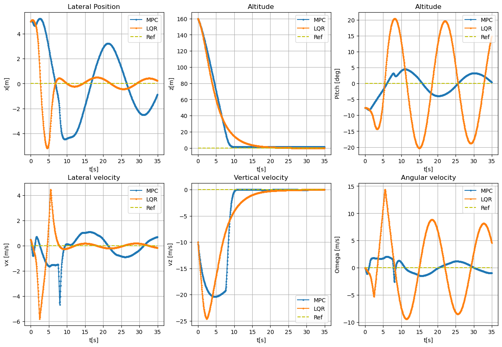
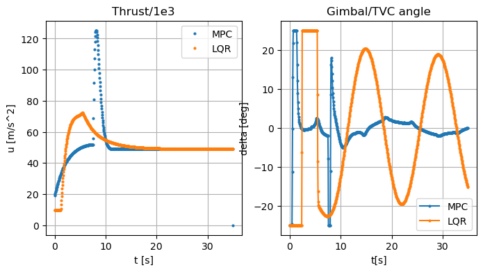
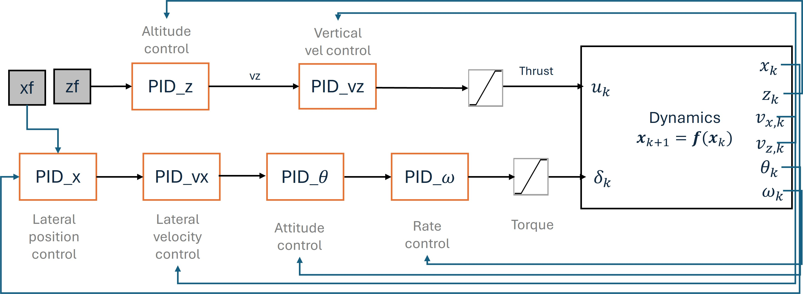
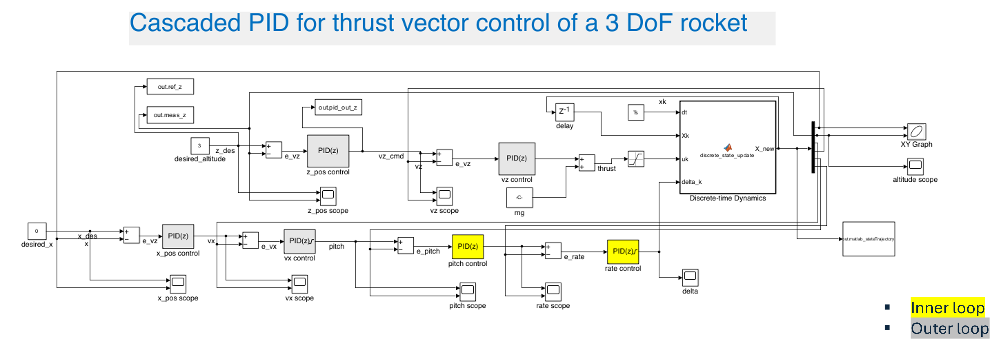
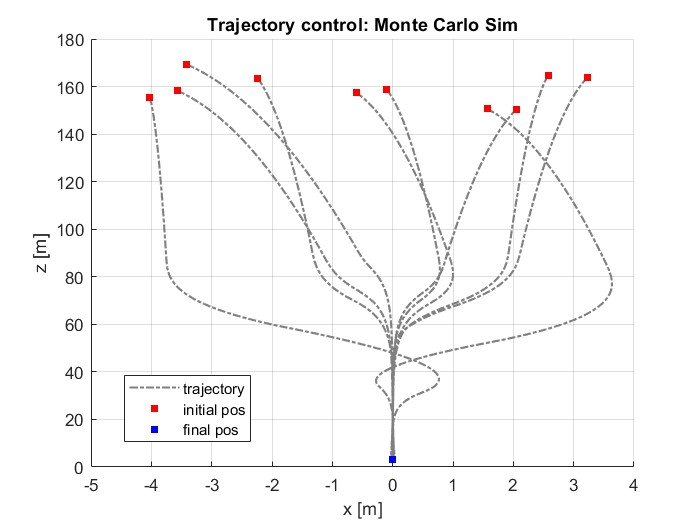

# 3DoF thrust vector control for rocket landing

### Description

Thrust vector control for a 3 DoF simplified rocket dynamics. Goal is to land the rocket from a random initial position and attitude to origin. 
Final state requirements: $$[0 \pm 5 m, 0 \pm 1 m,  0 \pm 3^\circ,  0 \pm 1 m/s, 
0 \pm 0.5  m/s,  0 \pm 5  rad/s ]$$. Assumption (can be relaxed): all states are directly observable without any uncertainty. 

The vehicle motion is described by only 3 Degrees of Freedom (3DoF), as follows:
-  $x$ : lateral position
-  $y$ : altitude
-  $\theta$ : attitude angle (pitch)
  

# MPC: Receding Horizon Control

MPC looks for optimal control law in the finite horizon (for N steps). It takes a cost minimizing step towards the goal - only for the fixed horizon. After executing the control for that step, it slides the horizon window, incorporates new information from trajectory, and computes the control towards the goal. 

## Objective Function
$$ \begin{equation} J = \frac{1}{2} (\mathbf{x}_N - \mathbf{x}_r)^T \mathbf{Q}_N (\mathbf{x}_N - \mathbf{x}_r) + \sum \frac{1}{2}(\mathbf{x}_k - \mathbf{x}_r)^T \mathbf{Q} (\mathbf{x}_k - \mathbf{x}_r) + \frac{1}{2} (\mathbf{u}_k - \mathbf{u}_r)^T \mathbf{R} (\mathbf{u}_k - \mathbf{u}_r) 
\end{equation}$$ 
 

The penalty on terminal states, deviation from nominal trajectory, and control is a convex optimization problem solved using quadratic programming. Solver used: OSQP. See the notebook for the controller block diagram.

## Conclusion and Future work
Coupled TVC and thrust control present a challenge in accurate attitude and angular velocity control. This is a difficult control problem, and minimizing oscillations in these states requires meticulous tuning. Importantly, a pre-planned trajectory for tracking through MPC could be helpful. This is a work in progress.
## Results

### Landing trajectory

### State history

### Control history

# PID Control
[rocket3DoF.slx](Simulink/rocket3DoF.slx) is the Simulink file for cascaded PID implementation for rocket-landing control. MATLAB file and initial conditions from ipynb.

## Cascaded PID control law

Requires meticulous tuning for your initial conditions

### Results: Monte Carlo Simulation

Landing trajectories with randomized initial state

